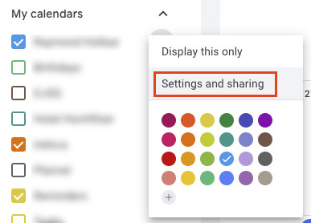

## Welcome to my collection of tech recipes

### How to build an epaper / eink weather / calendar display

#### Shopping list
* [Display](https://www.welectron.com/Waveshare-13380-75inch-e-Paper-B)
* [Display HAT](https://www.waveshare.com/e-Paper-Driver-HAT.htm)
* [Micro-SD-Card](https://www.welectron.com/SanDisk-Ultra-16-GB-A1-UHS-I-Class-10-microSD)
* [Raspberry](https://www.welectron.com/Raspberry-Pi-Zero-WH-mit-verloeteter-Stiftleiste)
* [Raspberry Case](https://www.welectron.com/Raspberry-Pi-Zero-Gehaeuse)
* [Keyboard Adapter](https://www.welectron.com/USB-20-OTG-Adapter)
* [Power Supply](https://www.welectron.com/Goobay-46600-Steckernetzteil-microUSB-5V-1A)

#### Wiring / Driver installation
* [Waveshare: "Hardware/Software setup >> Raspberry Pi"](https://www.waveshare.com/wiki/7.5inch_e-Paper_HAT_(B))

#### Software preparations

##### Weather API
* [OpenWeather API Key](https://openweathermap.org/appid)

##### Google Calendar iCal
* Google Calendar Settings 
* Google Calendar iCal URL 

#### Software installation
* [Inky Calendar](https://github.com/aceisace/Inky-Calendar)
* [MacOS image flashing](https://www.raspberrypi.org/documentation/installation/installing-images/mac.md)

### Bookmarks

#### How to choose a license
[Overview](https://choosealicense.com/appendix/)

#### How to edit this page
By [editor on GitHub](https://github.com/ingmar424242/tech/edit/master/README.md).

#### How to show this page in HTML
[Link](https://ingmar424242.github.io/tech/).
